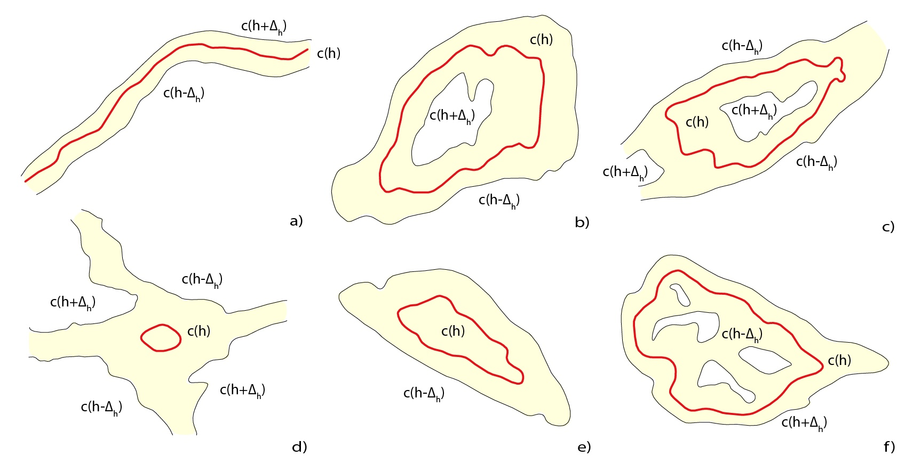

# Simplify contour lines using axial splines
Basic properties and features of the simplification algorithm, the input data and provided results, are described.

## 1.1. Source code
The source code of the simplification software written in C++ (C++ 2020) is bundled as the Visual Studio 2022 project. 
It depends on the Eigen library
- Eigen, https://gitlab.com/libeigen/eigen, 
which is bundled.

## 1.2. Running the software

The binary version (64 bit, VS 2022 compiler) of the clusterization software

     simplifyAXS.exe

can be found in \bin directory. To run the software, open the command prompt and use the following combination of parameters, values, and options: 

	simplifyAXS.exe file_name +parameter1=value1 +parameter2=value2 -option

#### Note:
The generated output dxf file in the  destination folder, containing results, will be overwritten. For further details, see Sec. 1.6.

## 1.3 Input files

The simplification algorithm requires fhe following data:
- Contour line c(h) of the given height h.
- Vertical buffer formed by the lower contour c(h - dh).
- Vertical buffer formed by the upper contour c(h + dh).

Each object, represented by contour line fragment or vertical vertical buffer, is stored in a separate CSV file. The input file contains the Cartesian coordinates X, Y, Z of the vertices of contour lines and buffers.

Source contour c(h), h=271 m, file 'contour_271.0_37.csv.
The contour name stores its height (271.0) and id(37)

	716760.3952809327 984135.9742799804 271.0
	716758.6807809327 984138.3343799805 271.0
	716752.8364809327 984146.2996799804 271.0
	716746.4332809327 984157.8285799804 271.0
	716742.3027809327 984165.8620799804 271.0
	716740.5406809327 984172.0404799804 271.0
	716738.4404809327 984176.2855799805 271.0
	716734.6108809327 984180.2318799804 271.0
	716729.0500809327 984184.3721799804 271.0
	716722.7397809327 984188.0845799805 271.0

Vertical buffer c(h - dh), dh = 0.1, h - dh = 270.9, file = 'buffer_B1_270.9_27.csv', example:
The lower vertical stores its height (270.9) and id(27)
	-716659.8204298521 -984236.4795014771 270.9
	-716660.3242005465 -984236.3242001563 270.9
	-716660.5701419857 -984236.2550386918 270.9
	-716660.8453549680 -984236.1546448352 270.9
	-716660.8160002468 -984236.5687168138 270.9
	-716660.6305784797 -984236.6305785101 270.9
	-716660.5073158112 -984236.7051947351 270.9
	-716660.2971106865 -984236.7028892142 270.9
	-716659.8204298521 -984236.5545886704 270.9

